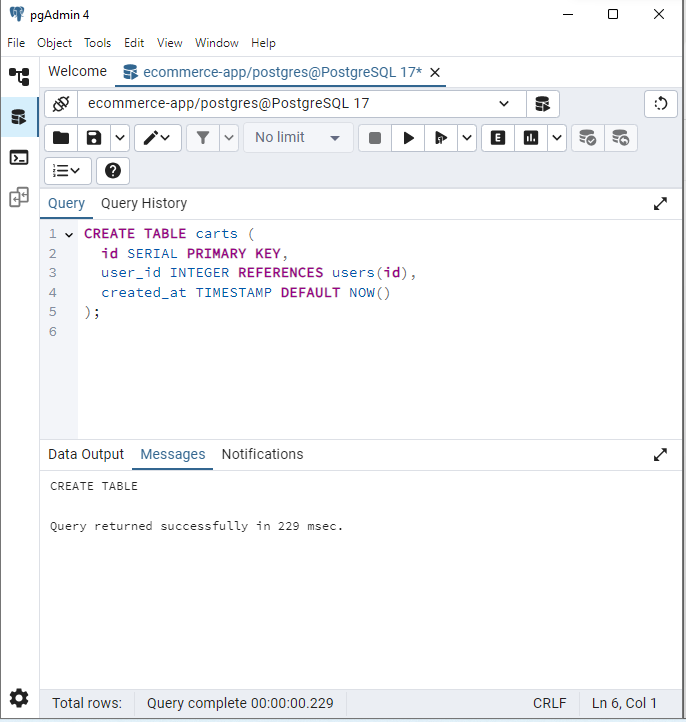
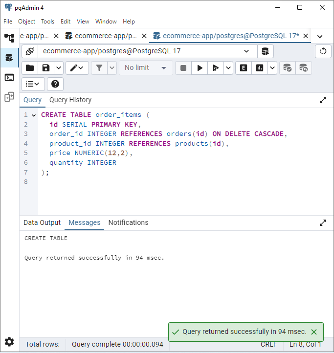
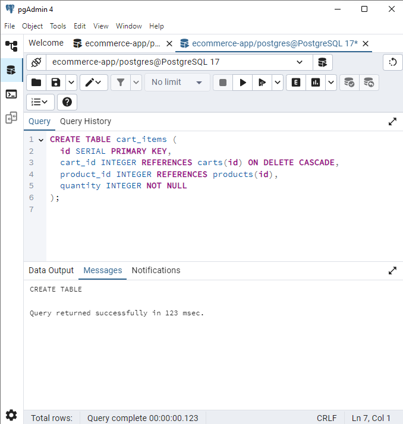
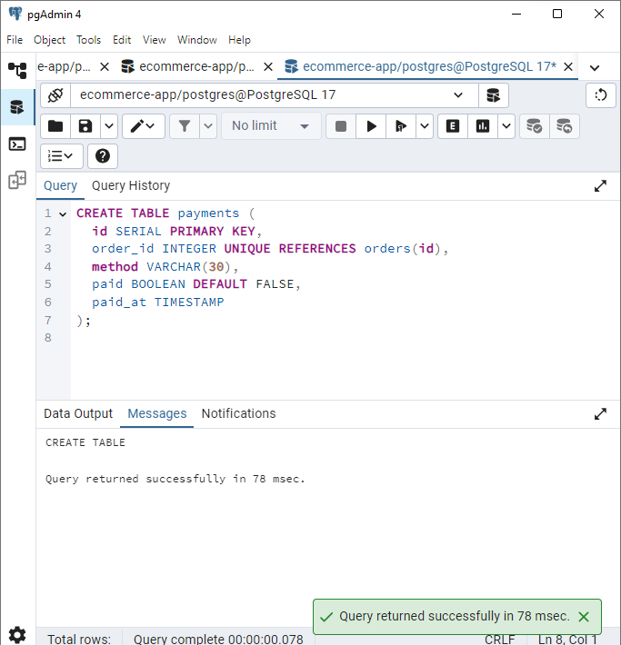
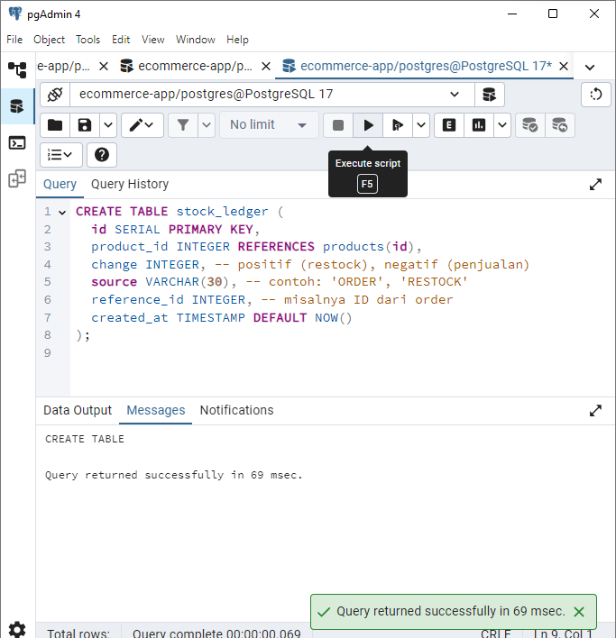
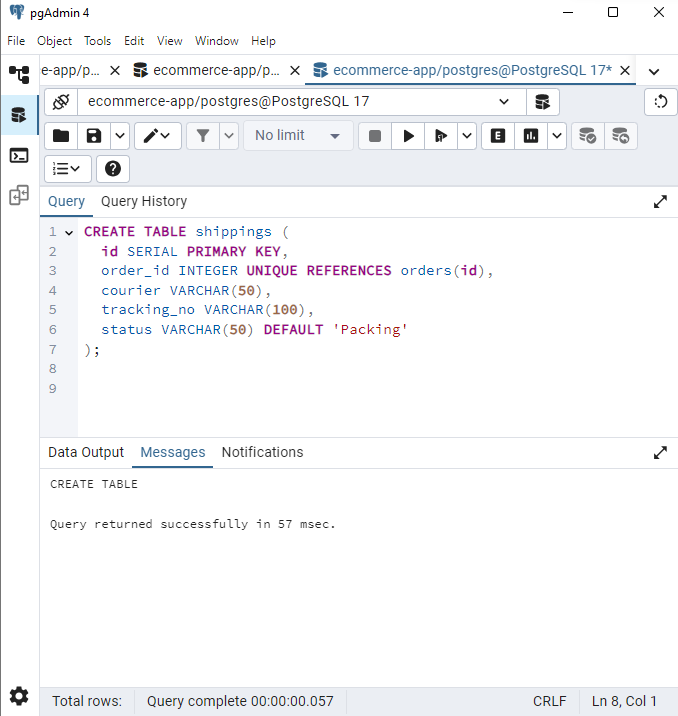
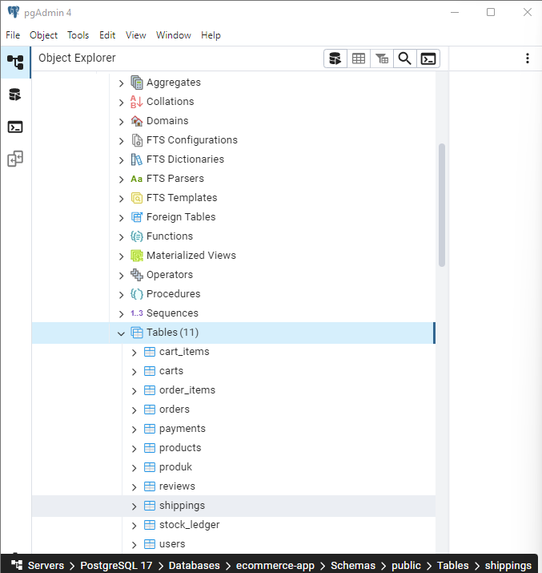
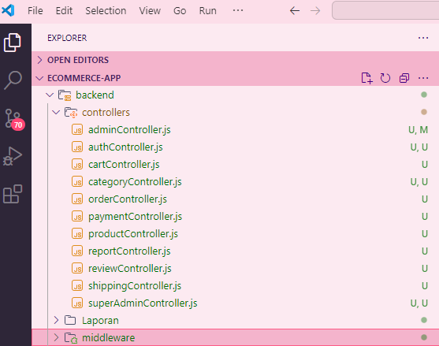

## **Laporan Progres Mingguan**

**Kelompok**: 10  
**Mitra**: Jaya Mandiri Motor  
**Pekan ke-**: 14  
**Tanggal**: 16 Mei 2025  

**Anggota**:
- Dzaky Rasyiq Zuhair_10231035_QA & DevOps  
- Muhammad Khoiruddin Marzuq_10231065_Frontend Developer  
- Riska Fadlun Khairiyah Purba_10231083_Project Manager & UI/UX Designer  
- Tiya Mitra Ayu Purwanti_10231088_Backend Developer 

---

### **📌 Progress Summary**

Pada pekan ke-14, tim berhasil menambahkan fitur utama yang masih berstatus dalam proses pengerjaan minggu lalu, yaitu fitur Cart, payment, report, category dan shipping. Tim berhasil mengembangkan fitur dengan fungsi yang berbeda beda fitur cart yang berfungsi sebagai keranjang belanja untuk user, fitur payment dapat digunakan untuk proses transaksi, fitur report berguna sebagai laporan penjualan, fitur category adalah fitur yang berfungsi agar dapat mempermudah mengekompokkan jenis barang, dan fitur shipping berfungsi untuk pembaruan status pengiriman. Pada pekan ini tim kami berhasil menuntaskan semua fitur.
---

### **✅ Accomplished Tasks**

**Bugfix Report**  
- Ditemukan Bug pada backend, yaitu pada fitur Order dan admin akan tetapi bug berhasil di perbaiki

**usability Test Report**  
- Fitur super admin berhasil di impelemtasikan
- Fitur admin berhasil di implementasikam
- Fitur Pengguna (pelanggan) berhasil dibuat dengan fitur lengkap

**Deployment Plan**  
- Sebelum persentasi dan program siap, Memastikan program berjalan lancar dan terstruktur. 

---

### **⚠️ Challenges & Solutions**

**Tantangan**: Terjadinya Eror terus menerus, di pekan sebelumnya kami berhasil menambahakan berapa fitur, kemudian di pekan ini, kami berhasil menambahkan 5 fitur utama, yaitu Cart, payment,report, category, dan shipping, semua fitur yang baru kami kembangkan terjadi eror, Saya (Backend developer) Sedikit mengalami kesulitan akan tetapi eror sudah berhasil terselesaikan, pada bagian pengujian di postman saya masih mengalami kesulitan.

**Solusi**: Solusi yang kami lakukan adalah melakukan pengujian terus menerus, dan mencari letak eror tersebut, pada pengalaman pekan ini, kami lupa menmabahkan perintah const dan perintah app.use.

---

### **🗓️ Next Week Plan**

- Memastikan program sudah siap berjalan dengan lancar
- Menyimapkan Slide dan demo sebagai tahap Final 

---

### **🙋‍♀️ Contributions**

- **Riska Fadlun Khairiyah P (Project Manager & UI/UX Designer)**: memastikan konsistensi antara frontend dan backend. 
- **Dzaky Rasyiq Zuhair (QA & DevOps)**: Melakukan testing pada operasi CRUD, debugging. 
- **Muhammad Khoiruddin Marzuq (Frontend Developer)**: Memastikan tampilan responsive untuk semua operasi CRUD.
- **Tiya Mitra Ayu Purwanti (Backend Developer)**: Membuat struktur tabel baru, yaitu cart, cart_items, payments, shipping, dan pembaruan tabel order, order_items, mengimplementasikan logika update stok produk, membangun koneksi database. Menyusun dokumentasi.

---

### **🖼️ Screenshots/Demo**

#### a. Menambahkan Tabel baru
  
Gambar di atas adalah tabel cart

  
Gambar di atas adalah detai belanja

  
Gambar di atas adalah tabel isi keranjang

  
Gambar di atas adalah tabel payment

  
Gambar di atas adalah tabel riwayat order dan restock

  
Gambar di atas adalah tabel shipping

#### b. Menambahkan Tabel database
Gambar di bawah menunjukkan tahap menambahkan tabel baru pada  PostgreSQL.  

**Dokumentasi ketika sudah Menambahkan tabel baru**:  
  
Gambar tersebut menunjukan Tabel yang ada di dalam database ecommerce-app

#### b. Menambahkan fitur utama

Gambar diatas lampiran tambahan kode pada controllers

Gambar diatas lampiran tambahan kode pada routes. 

