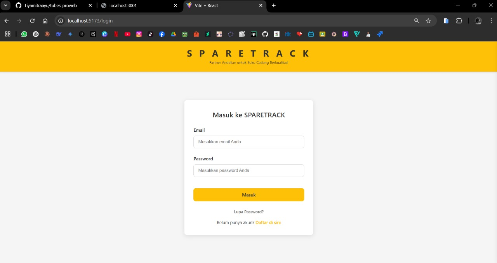
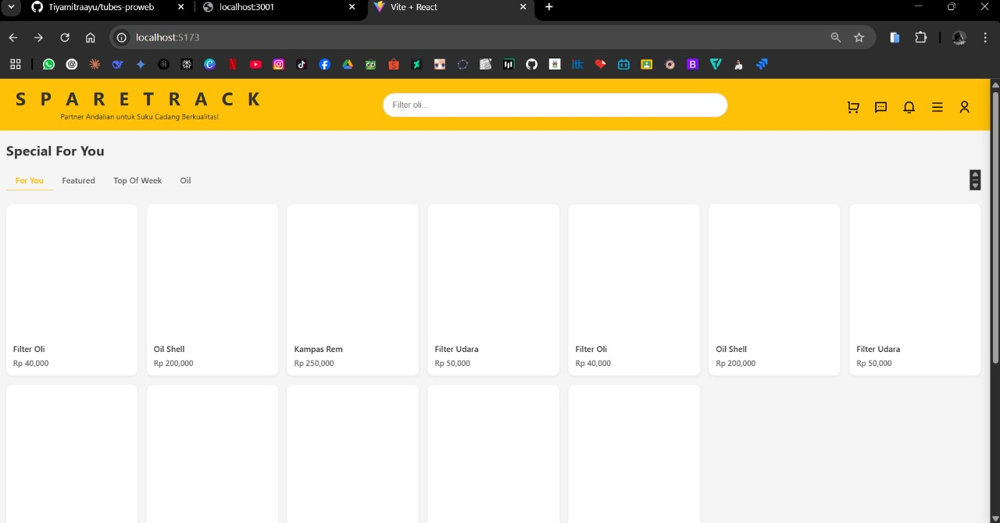
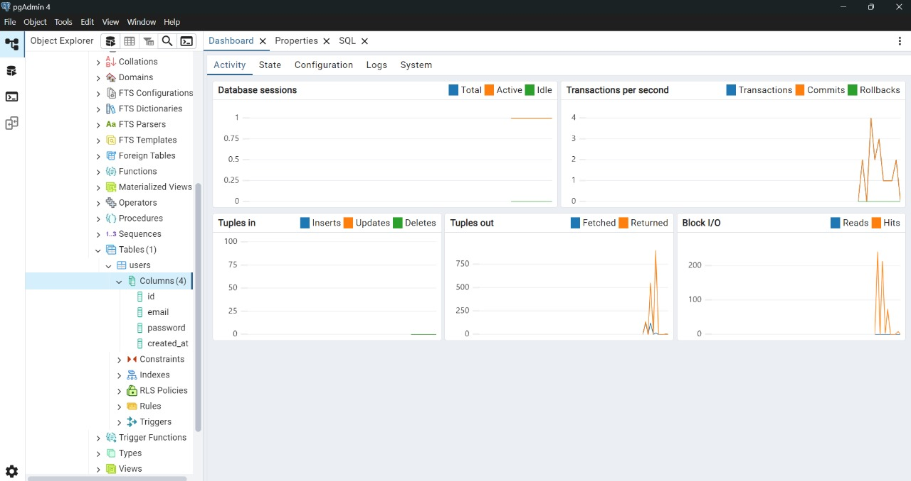

## **Laporan Progres Mingguan**
**Kelompok**: 10  
**Mitra**: Jaya Mandiri Motor  
**Pekan ke-**: 10  
**Tanggal**: 18 April 2025  
**Anggota**:
- Dzaky Rasyiq Zuhair_10231035_QA & DevOps  
- Muhammad Khoiruddin Marzuq_10231065_Frontend Developer  
- Riska Fadlun Khairiyah Purba_10231083_Project Manager & UI/UX Designer  
- Tiya Mitra Ayu Purwanti_10231088_Backend  

### **📌 Progress Summary**
Pada pekan ke-10, tim fokus pada perancangan skema database, pembangunan backend skeleton, serta penyiapan tampilan awal frontend. Struktur dasar API dan halaman frontend sudah dibuat, serta dilakukan demo awal ke mitra.

### **✅ Accomplished Tasks**
**Desain Database (ERD)**:
- Mendesain skema database sesuai kebutuhan sistem  
- Pembuatan Entity Relationship Diagram (ERD) untuk entitas utama  

**Backend Skeleton**:
- Implementasi endpoint dasar (GET & POST produk)  
- Setup struktur folder backend dengan PHP  

**Frontend Skeleton**:
- Membuat struktur awal React App (routing & halaman kosong)  
- Menyambungkan React dengan endpoint backend untuk testing awal  

**Demo ke Mitra**:
- Menunjukkan struktur database, skema API, dan tampilan awal frontend  

### **⚠️ Challenges & Solutions**
**Tantangan**: Penyesuaian struktur database dengan kebutuhan mitra  
**Solusi**: Berdiskusi ulang dan revisi ERD agar sesuai dengan alur bisnis mitra  

**Tantangan**: Integrasi awal frontend dan backend sempat gagal karena CORS  
**Solusi**: Menambahkan konfigurasi CORS pada server PHP agar request React diterima  

### **🗓️ Next Week Plan**
- Menyelesaikan sistem autentikasi (Login/Register/Logout) menggunakan PHP & MySQL  
- Mengembangkan core feature #1: Penambahan produk ke katalog oleh admin  
- Mengintegrasikan backend (API) dengan frontend (React) untuk fitur login dan katalog  

### **🙋‍♀️ Contributions**
**- Riska Fadlun Khairiyah P (Project Manager & UI/UX Designer)**: Membuat laporan dan dokumentasi progres proyek 📄, serta memantau jalannya tugas tim, membantu backend  
**- Dzaky Rasyiq Zuhair (QA & DevOps)**: Mendesain ERD (Entity Relationship Diagram) sebagai skema database yang akan diimplementasikan, serta menyiapkan testing awal dan integrasi tools DevOps.  
**- Muhammad Khoiruddin Marzuq (Frontend Developer)**: Mengembangkan frontend skeleton berupa halaman dasar React dengan implementasi routing antar halaman.  
**- Tiya Mitra Ayu Purwanti (Backend Developer)**: Membangun backend skeleton berupa endpoint dasar (minimal 2) yang sudah berfungsi.  

### **🖼️ Screenshots/Demo**
- [ERD Diagram (Draw.io)](https://drive.google.com/file/d/1EYPQnhlKFDR1NvrpqHQRBpECOGSS0vNY/view?usp=sharing)  

### **Penjelasan ERD**
## **Deskripsi Entitas dan Relasi**

### **User**
Menyimpan data pengguna (bisa admin atau customer).  
**Relasi:**
- Satu user memiliki banyak keranjang.
- Satu user bisa membuat banyak pesanan.
- Satu user bisa memberi banyak ulasan.

---

### **Keranjang**
Berisi data keranjang milik user.  
**Relasi:**
- Satu keranjang dimiliki oleh satu user.
- Satu keranjang punya banyak item di tabel `KeranjangItem`.

---

### **KeranjangItem**
Merupakan entitas penghubung antara keranjang dan sparepart.  
**Relasi:**
- Setiap item menghubungkan satu keranjang dan satu sparepart.
- Menyimpan jumlah sparepart dalam keranjang.

---

### **Sparepart**
Menyimpan data sparepart (nama, harga, stok, dll).  
**Relasi:**
- Satu sparepart bisa berada di banyak keranjang dan pesanan (via `KeranjangItem` dan `PesananDetail`).
- Satu sparepart punya banyak ulasan.
- Satu sparepart berada dalam satu kategori.

---

### **Kategori**
Menyimpan jenis atau kategori sparepart (misal: mesin, kelistrikan, dll).  
**Relasi:**
- Satu kategori memiliki banyak sparepart.

---

### **Pesanan**
Menyimpan data pemesanan dari user.  
**Relasi:**
- Satu pesanan dimiliki oleh satu user.
- Satu pesanan memiliki banyak sparepart (via `PesananDetail`).
- Satu pesanan memiliki satu pembayaran.

---

### **PesananDetail**
Entitas penghubung antara pesanan dan sparepart.  
Menyimpan kuantitas dan harga per item saat dipesan.  
**Relasi:**
- Menghubungkan satu pesanan dengan satu sparepart.

---

### **Pembayaran**
Menyimpan data pembayaran dari suatu pesanan.  
**Relasi:**
- Satu pembayaran untuk satu pesanan *(1:1)*.

---

### **Ulasan**
Menyimpan review/komentar dari user terhadap sparepart.  
**Relasi:**
- Menghubungkan satu user dengan satu sparepart.

---

- [GitHub Repo](https://github.com/Tiyamitraayu/tubes-proweb.git)  

---

-   

### **🧩 Penjelasan Tampilan Antarmuka (Frontend)**
Gambar tersebut menunjukkan tampilan antarmuka (frontend) dari sebuah aplikasi web yang dibangun menggunakan Vite + React. Berdasarkan tampilannya, berikut adalah penjelasan struktur skeleton frontend-nya:

1. **Navbar (Bagian Atas)**  
   Terletak di bagian atas halaman, dengan latar belakang biru gelap.  
   Teks "My App" di sebelah kiri sebagai nama atau brand aplikasi.  
   Tautan navigasi di sebelah kanan: Home, About, dan Contact — kemungkinan menggunakan React Router untuk navigasi antar halaman.

2. **Main Content (Isi Halaman)**  
   Saat ini menampilkan halaman Home Page.  
   Teks yang tampil:  
   - "Home Page" sebagai judul utama (`<h1>`)  
   - "Welcome to our application!" sebagai subjudul atau deskripsi (`
`)  
   Bagian ini merupakan isi dinamis yang akan berubah tergantung pada rute yang diakses (misalnya ke /about, /contact, dsb.).

3. **Footer (Bagian Bawah)**  
   Berwarna biru gelap seperti navbar.  
   Terdapat teks: "© 2025 My Application. All rights reserved."  
   Menunjukkan bahwa aplikasi ini memiliki struktur halaman lengkap: header (navbar), content, dan footer.

4. **Port Lokal**  
   Aplikasi dijalankan secara lokal pada port 5173 (`localhost:5173`), yang merupakan default port dari Vite.

---

  

Gambar diatas adalah tahap membuka aplikasi Postman, lalu membuka request dan memilih metode POST, kemudian memasukkan URL endpoint `http://localhost:3001/produk`, pada bagian tab body, pilih raw dan mengubah format ke JSON. Kemudian data produk baru seperti di gambar, klik tombol send. Output berhasil dapat dilihat pada gambar.

Gambar diatas adalah tahap membuka aplikasi
Postman, lalu membuka request dan memilik metode
GET, kemudian memasukan URL endpoint ‘
http://localhost:3001/produk’, klik tombol send. Outupt
berhasil dapat di liat pada gambar.
Database meberi response dengan menampilkan
daftar semua produk yang ada di database.