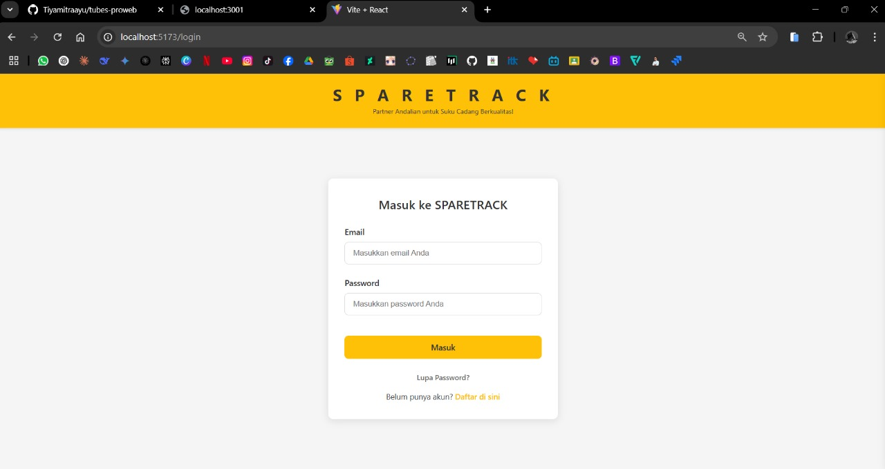
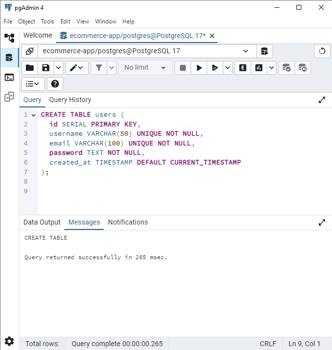

## **Laporan Progres Mingguan**

**Kelompok**: 10  
**Mitra**: Jaya Mandiri Motor  
**Pekan ke-**: 11  
**Tanggal**: 25 April 2025  

**Anggota**:
- Dzaky Rasyiq Zuhair_10231035_QA & DevOps  
- Muhammad Khoiruddin Marzuq_10231065_Frontend Developer  
- Riska Fadlun Khairiyah Purba_10231083_Project Manager & UI/UX Designer  
- Tiya Mitra Ayu Purwanti_10231088_Backend Developer  

---

### **📌 Progress Summary**

Pada pekan ke-11, tim fokus pada implementasi sistem autentikasi pengguna (login, register, logout) serta pengembangan fitur inti pertama, yaitu penambahan produk ke katalog oleh admin. Selain itu, tim berhasil mengintegrasikan frontend dan backend untuk fitur-fitur tersebut dan melakukan demo progres kepada mitra.

---

### **✅ Accomplished Tasks**

**Sistem Autentikasi**:
- Implementasi endpoint login, register, dan logout menggunakan PHP & MySQL  
- Validasi input dan penyimpanan data user yang aman (hash password)  
- Integrasi autentikasi dengan frontend  

**Core Feature #1 - Produk Katalog (Admin)**:
- Pengembangan fitur penambahan produk baru ke dalam katalog  
- Pembuatan form input produk di frontend  
- Integrasi dengan API backend  

**Integrasi Frontend & Backend**:
- Pengujian dan koneksi login/register via React  
- Pengujian fitur katalog produk (POST & GET produk)  
- Pengujian response dan pengolahan data produk dari server  

**Demo ke Mitra**:
- Menunjukkan alur login dan register  
- Menunjukkan fitur tambah produk dan tampilan katalog  

---

### **⚠️ Challenges & Solutions**

**Tantangan**: Form register tidak menampilkan pesan kesalahan dan data tidak masuk ke database meskipun UI tampil normal.  
**Solusi**: Dilakukan debugging koneksi frontend ke backend, kemudian ditambahkan pengecekan respons dari API, serta penanganan error pada React agar error dari server (seperti koneksi database gagal) bisa ditampilkan ke user.

---

### **🗓️ Next Week Plan**

- Implementasi fitur inti #2 dan #3  
- Penyempurnaan UI/UX  
- Pengujian integrasi  
- Demo progress ke mitra  

---

### **🙋‍♀️ Contributions**

- **Riska Fadlun Khairiyah P (Project Manager & UI/UX Designer)**: Membuat dokumentasi mingguan dan mengatur demo ke mitra, membantu anggota lain.  
- **Dzaky Rasyiq Zuhair (QA & DevOps)**: Membuat dan menguji endpoint login/register/logout serta tambah produk dengan PHP + MySQL.  
- **Muhammad Khoiruddin Marzuq (Frontend Developer)**: Membuat halaman login dan register menggunakan React, serta menyambungkan form ke API, membuat desain form login/register.  
- **Tiya Mitra Ayu Purwanti (Backend Developer)**: Membuat dan menguji endpoint login/register/logout serta tambah produk dengan PHP + MySQL.  

---

### **🖼️ Screenshots/Demo**

  
Ini adalah halaman pendaftaran akun baru di aplikasi SPARETRACK.

User diminta mengisi:
- Email (input field pertama)
- Password (input field kedua)
- Konfirmasi Password (input field ketiga)

Ada tombol "Daftar" berwarna kuning untuk submit data.  
Di bawah tombol, ada teks "Sudah punya akun? Masuk di sini" yang mengarahkan ke halaman login.

---

  
Ini adalah halaman login user ke dalam SPARETRACK.

User diminta memasukkan:
- Email (input pertama)
- Password (input kedua)

Ada tombol "Masuk" besar berwarna kuning.  
Di bawah tombol:
- Link "Lupa Password?" untuk reset password.
- Teks "Belum punya akun? Daftar di sini" untuk redirect ke halaman register.

---

  
Ini adalah halaman beranda produk untuk user di SPARETRACK.

Di bagian atas ada navbar kuning dengan:
- nama SPARETRACK
- Search bar (untuk mencari produk, placeholder: "Filter oli...")
- Ikon-ikon cart, chat, dan profile user di kanan atas

Ada bagian tab navigasi seperti:
- For You | Featured | Top Of Week | Oil

Menampilkan kartu-kartu produk seperti:
- Filter Oli – Rp 40.000
- Oil Shell – Rp 200.000
- Kampas Rem – Rp 250.000

Produk lainnya (terlihat banyak produk disusun grid).  
Layout produk menggunakan gaya kartu (card) dengan judul dan harga.

---

  
  

Tabel `users` berisi `id`, `username`, `email`, `password`, dan `created_at` untuk menyimpan data akun pengguna. Form register dan login sudah sesuai dengan struktur tabel ini. Monitoring database menunjukkan aktivitas transaksi yang berjalan normal. Untuk fitur katalog, perlu dibuat tabel baru yang khusus menyimpan data sparepart.

---
