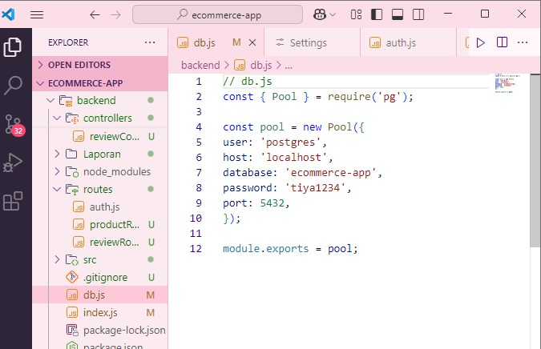
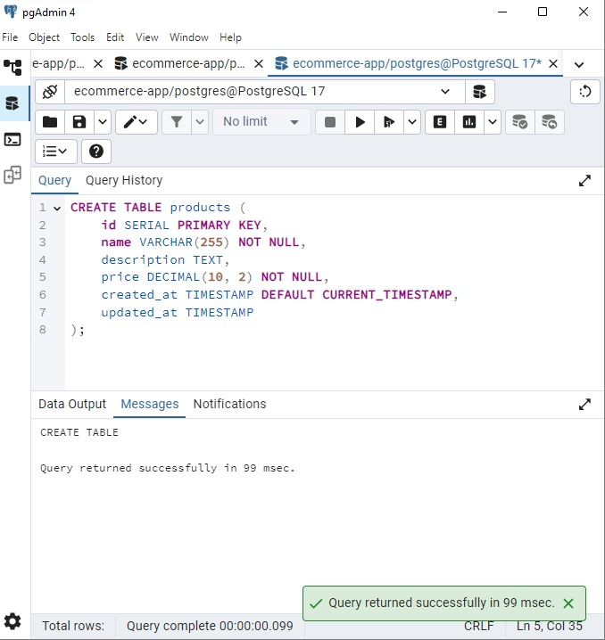
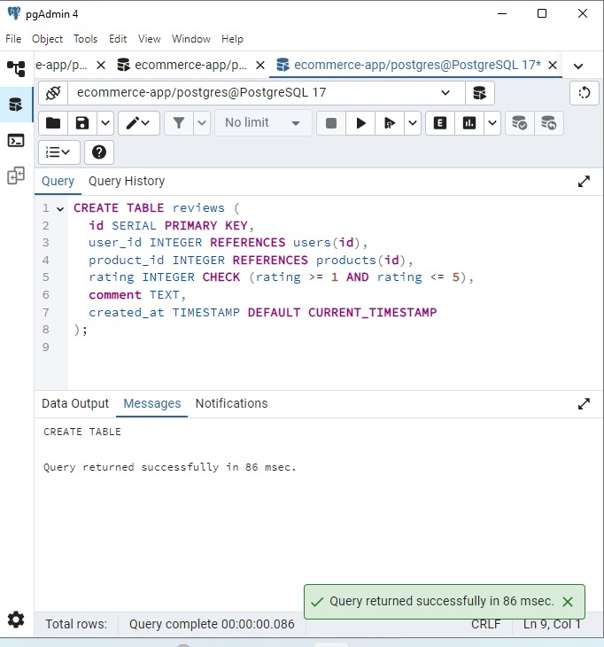
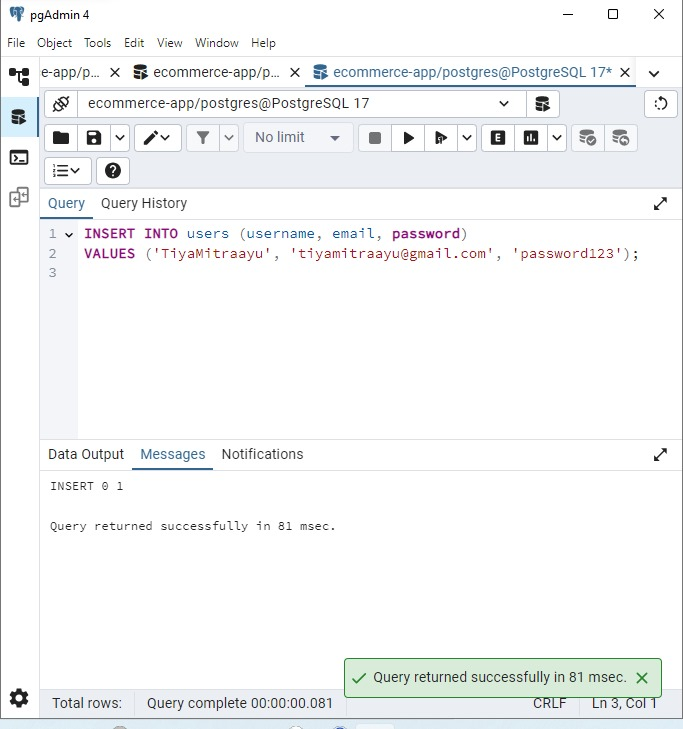
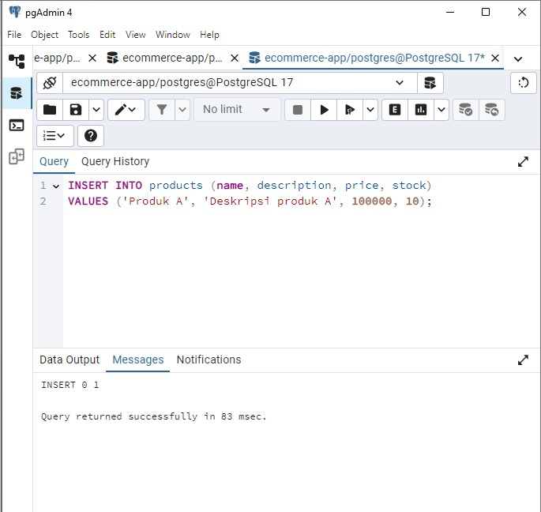
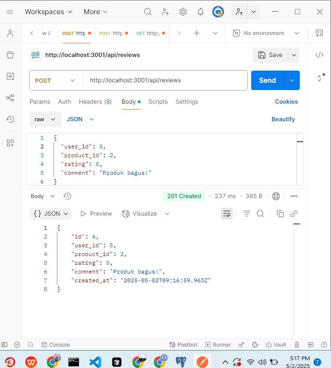
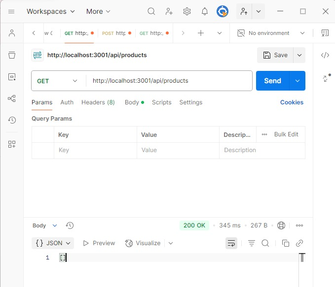
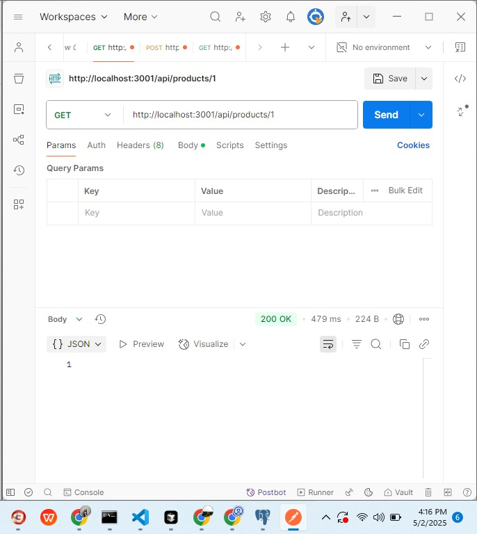
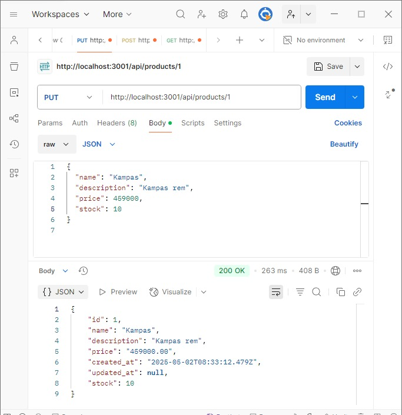
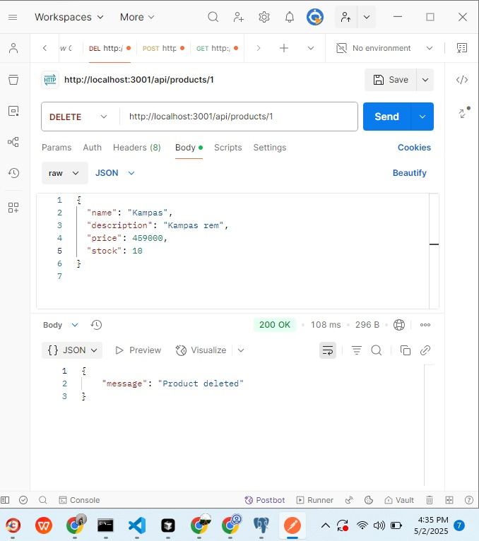

## **Laporan Progres Mingguan**

**Kelompok**: 10  
**Mitra**: Jaya Mandiri Motor  
**Pekan ke-**: 12  
**Tanggal**: 2 Mei 2025  

**Anggota**:
- Dzaky Rasyiq Zuhair_10231035_QA & DevOps  
- Muhammad Khoiruddin Marzuq_10231065_Frontend Developer  
- Riska Fadlun Khairiyah Purba_10231083_Project Manager & UI/UX Designer  
- Tiya Mitra Ayu Purwanti_10231088_Backend Developer  

---

### **📌 Progress Summary**
Pada pekan ke-12, tim menyelesaikan fitur pengelolaan stok dan manajemen transaksi, melakukan perbaikan UI/UX berdasarkan masukan mitra, serta menulis beberapa unit test untuk fungsi penting.
---

### **✅ Accomplished Tasks**

**Core Feature #2 - Pengelolaan Stok (Admin)**  
- Admin dapat memperbarui jumlah stok produk  
- Validasi terhadap stok negatif  
- Integrasi pembaruan stok dengan katalog  

**Core Feature #3 - Manajemen Transaksi**  
- Simulasi transaksi pembelian oleh customer  
- Penyimpanan data transaksi di database  
- Halaman riwayat transaksi  

**UI Enhancement**  
- Perbaikan layout form dan penempatan elemen  
- Penambahan indikator loading dan error message  
- Penyesuaian warna tombol dan kontras untuk aksesibilitas  

**Frontend Development**  
- Implementasi tampilan CRUD produk dan review  
- Form create/update produk terhubung ke backend  
- Responsivitas tampilan di berbagai ukuran layar  

**Backend Development**  
- Pembuatan tabel produk, review, dan transaksi  
- Endpoint CRUD produk dan review  
- Logika pengurangan stok saat transaksi 

---

### **⚠️ Challenges & Solutions**

**Tantangan**: Terjadi beberapa error di postman   
**Solusi**: Melakukan debugging terhadap request dan response, memeriksa format endpoint, header, serta parameter yang dikirim. Error berhasil diatasi dengan memperbaiki konfigurasi dan menyesuaikan struktur data sesuai spesifikasi backend.

**Tantangan**: Terjadinya kesalahan saat akan nge-push ke github    
**Solusi**: Mengecek kembali konfigurasi Git, memastikan remote repository sudah benar, melakukan git pull terlebih dahulu jika ada perubahan terbaru, dan menyelesaikan konflik merge sebelum mencoba push ulang.

---

### **🗓️ Next Week Plan**

- Implementasi **Core Feature #4 : fitur utama 4**  
- Pembuatan **admin panel dashboard sederhana** untuk pengelolaan data  
- Penambahan **visualisasi data berupa chart/grafik sederhana** jika relevan
- Testing
- Memperbaiki yang kurang dari tugas pekan 12 

---

### **🙋‍♀️ Contributions**

- **Riska Fadlun Khairiyah P (Project Manager & UI/UX Designer)**: Menyusun dokumentasi, mengkoordinasi alur kerja CRUD produk dan review,memastikan konsistensi antara frontend dan backend
- **Dzaky Rasyiq Zuhair (QA & DevOps)**: Melakukan testing pada operasi CRUD, debugging pada proses update dan delete produk, menyiapkan environment testing untuk semua endpoint
- **Muhammad Khoiruddin Marzuq (Frontend Developer)**: Memastikan tampilan responsive untuk semua operasi CRUD,   mengimplementasikan tampilan untuk operasi produk, membuat form untuk create/update produk, 
- **Tiya Mitra Ayu Purwanti (Backend Developer)**: Membuat struktur tabel products dan reviews,  mengembangkan semua endpoint API,  menangani operasi delete produk ,mengimplementasikan logika update stok produk, membangun Koneksi database
---

### **🖼️ Screenshots/Demo**

### a. Koneksi Database

Gambar diatas yaitu db.js, file koneksi dengan database

### b. Pembuatan Tabel
Gambar dibawah adalah tahap membuat tabel produk dan review postgreSQL

Struktur tabel `products` dengan kolom:
- id
- name
- description 
- price
- created_at
- updated_at

Struktur tabel `reviews` dengan kolom:
- id
- user_id
- product_id
- rating
- comment
- created_at

### c. Operasi CRUD
#### Tambah User baru

Gambar diatas menunjukkan bahwa berhasil menambahkan data pengguna baru ke tabel users dengan username, email, dan password

#### Tambah Produk Baru

Gambar diatas berhasil menambahkan data produk baru ke tabel products dengan nama "Produk A", deskripsi, harga 100000, dan stok 10

#### Buat Review

Gambar diatas adalah cara mengirim ulasan baru (review) ke server dengan metode POST. Data yang dikirim termasuk ID pengguna, ID produk, rating, dan komentar. Server merespons dengan data ulasan yang berhasil dibuat, termasuk ID dan waktu pembuatannya.

### Read
#### Daftar Produk

Gambar diatas menampilkan endpoint untuk mengambil daftar produk (GET). Tidak ada data yang dikirim, dan tidak ada filter (query params) yang digunakan. Ini hanya permintaan biasa untuk melihat semua produk yang tersedia

#### Detail Produk

Gambar diatas itu menunjukkan cara melihat detail produk dengan ID 1. Ini menggunakan metode GET ke alamat http://localhost:3001/api/products/1. Hasilnya sukses (200 OK) tapi data produknya tidak kelihatan di gambar ini.

#### Update

Gambar diatas memperlihatkan cara mengubah data produk yang sama (ID 1) dengan metode PUT. Data yang dikirim termasuk nama produk "Kampas" (kampas rem), harga Rp459.000, dan stok 10. Setelah diupdate, sistem mengembalikan data produk yang sudah diubah, termasuk format harga yang otomatis berubah jadi desimal (459000.00) dan informasi waktu pembuatan produk

#### Delete

Gambar diatas menggunakan Postman untuk menghapus produk dengan id = 1 lewat endpoint DELETE /api/products/1. Respon dari server adalah 200 OK, yang artinya produk berhasil dihapus, dengan pesan: "Product deleted".
