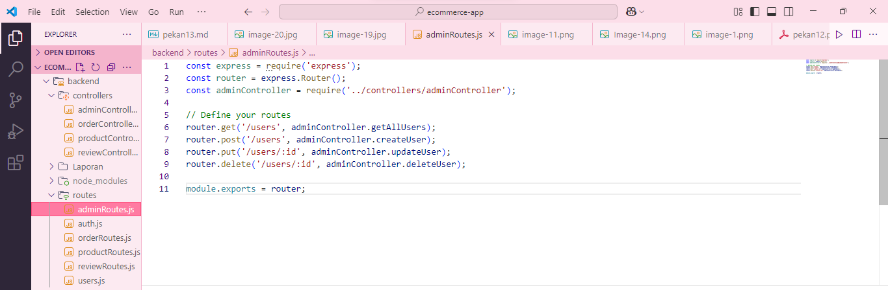
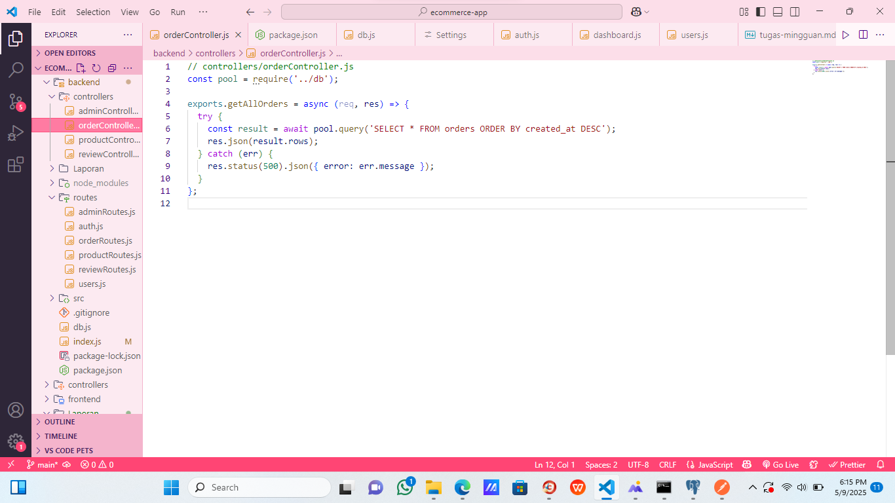
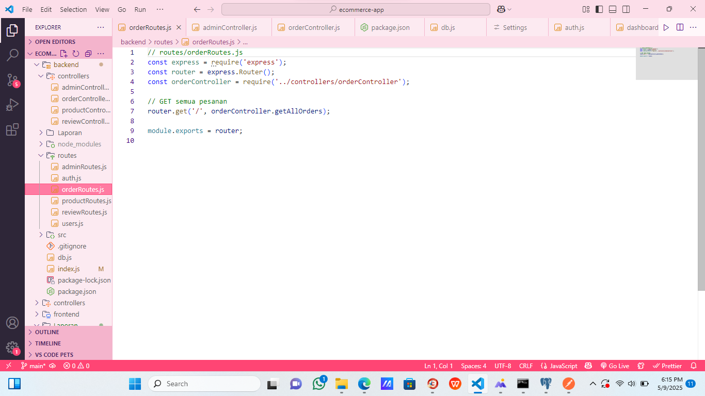
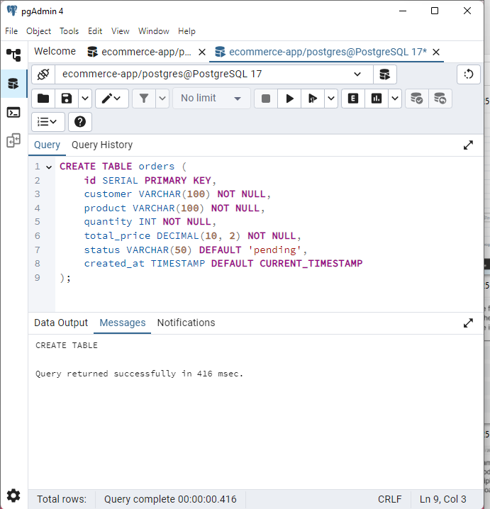
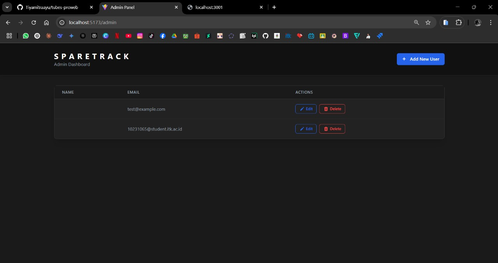
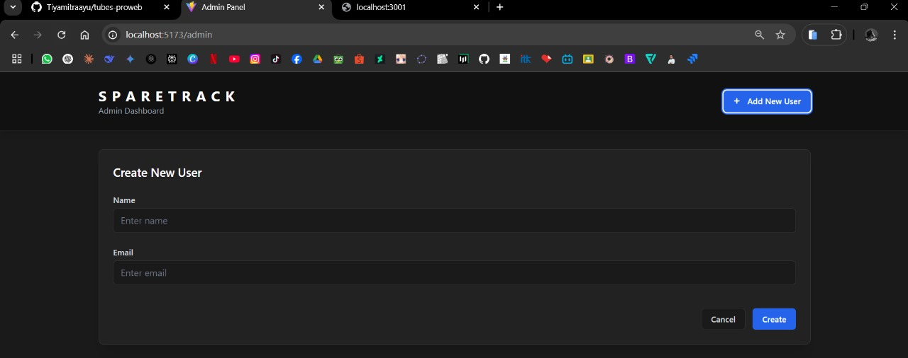

## **Laporan Progres Mingguan**

**Kelompok**: 10  
**Mitra**: Jaya Mandiri Motor  
**Pekan ke-**: 13  
**Tanggal**: 9 Mei 2025  

**Anggota**:
- Dzaky Rasyiq Zuhair_10231035_QA & DevOps  
- Muhammad Khoiruddin Marzuq_10231065_Frontend Developer  
- Riska Fadlun Khairiyah Purba_10231083_Project Manager & UI/UX Designer  
- Tiya Mitra Ayu Purwanti_10231088_Backend Developer  

---

### **📌 Progress Summary**

Pada pekan ke-13, tim berhasil menambahkan fitur baru ke dalam sistem, yaitu fitur admin dan order. Tim berhasil membuat fitur admin yang dapat memanajemen penggunaan dan pengaturan sistem, semestara fitur orders digunakan untuk menangai alur pemesanan. Penambahkan ini dapat meningkatkan dan memperkuat pengembangan fitur selanjutnya.

---

### **✅ Accomplished Tasks**

**Core Feature #4 - Fitur Utama orders**  
- Fitur orders berguna untuk menangai alur terkait pemesanan, seperti membuat pesanan baru, melihat daftar pesanan, dan memantau status pesanan.

**Admin panel**  
- Fitur admin dalam sistem berguna untuk manajemen data, Admin dapat melijat, mengubah, atau menghapus data seperti, produk, pesanan, kategori dan pengguna.  
- Fitur admin berfungsi untuk membatasi akses ke fungsi-fungsi tertentu agar hanya dapat diakes oleh user dengan peran admin. 
 
**Frontend Development**  
- Implementasi tampilan CRUD Admin dan fitur order
- Form create/update produk terhubung ke backend  
- Responsivitas tampilan di berbagai ukuran layar  

**Backend Development**  
- Pembuatan tabel Ordes
- Endpoint CRUD admin dan fitur order

---

### **⚠️ Challenges & Solutions**

**Tantangan**: Terjadinya kesalahan pada file package-lock.json, sehingga terjadi eror
**Solusi**: Solusi yang kami lakukan adalah menghapus file package-lock.json beserta folder node_modules, Kemudian menjalankan ulang perintah npm instal, dengan tujuan untuk memberishkan dari maslaha dan membuat ulang package-lock.json secara otomatis berdasarkan daftar paket yang ada di package-lock.json.

---

### **🗓️ Next Week Plan**

- Menambahkan fitur sesuai rencana awal yang sudah di susun dengan kesepakatan mitra.
- Memasukin tahap penyempurnaan seluruh fitur
- Bugfixing
Usability testing
Persiapan deployment (jika diperlukan)
Demo progress ke mitra

---

### **🙋‍♀️ Contributions**

- **Riska Fadlun Khairiyah P (Project Manager & UI/UX Designer)**: Menyusun dokumentasi, mengkoordinasi alur kerja CRUD produk dan review, memastikan konsistensi antara frontend dan backend, Membantu membackeup pengembangan CRUD admin dan fitur orders. 
- **Dzaky Rasyiq Zuhair (QA & DevOps)**: Melakukan testing pada operasi CRUD, debugging pada proses update dan delete produk, menyiapkan environment testing untuk semua endpoint  
- **Muhammad Khoiruddin Marzuq (Frontend Developer)**: Memastikan tampilan responsive untuk semua operasi CRUD, mengimplementasikan tampilan untuk operasi produk, membuat form untuk create/update produk  
- **Tiya Mitra Ayu Purwanti (Backend Developer)**: Membuat struktur tabel products dan reviews, mengembangkan semua endpoint API, menangani operasi delete produk, mengimplementasikan logika update stok produk, membangun koneksi database.Membantu menyusuk dokumentasi dan koorniasi tim.

---

### **🖼️ Screenshots/Demo**

#### a. Menambahkan kode baru
  
Gambar di atas adalah berisi kode yang digunakan untuk menangai fungsi-fungsi yang hanya di miliki oleh admin, fungsi tersebut berguna untuk mengambil, membuat, memperbarui, dan menghapus data dari user.

  
Gambar di atas adalah berfungsi untuk menangkap permintaan atau menanangi permintan terkait admin dengan menghubungkan ke Controller yang akan diakses oleh tim frontend.

  
Gambar di atas adalah berfungsi untuk menanangi entitas Order dalam sebuah web yang memiliki layanan pemesanan.

  
Gambar di atas adalah berfungsi untuk menghubungkan ke controller.

#### b. Pembuatan Tabel database
Gambar di bawah menunjukkan tahap pembuatan tabel produk dan review di PostgreSQL.  

**Tabel database orders**:  
  
Struktur tabel `products` dengan kolom:  
- id
- customer 
- product
- quantity 
- total_price
- status 
- created_at

#### b. Tampilan CRUD admin

Gambar diatas menunjukan tampilan dari fungsi baru yang sudah berhasil kami kembangkan, tampilan di atas adalah fitur yang hanya dapat di akses oleh user dengan peran admin. Pada halaman yang ditampilkan diatas memiliki fungsi yang berbeda beda, tampilan diatas sudah di lengkapi stayling visual.

Gambar diatas lampiran tambahan. 

